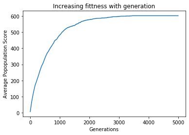

# Million Monkey Generator


```python
import pandas as pd
import numpy as np
import matplotlib.pyplot as plt
import string
import random
import time


# 1 Read in file 

filename= 'sonnet15.txt'

with open(filename) as file:
    ss = file.read()
    
# number of characters in SS
ss_length = len(ss)

```

# Psuedo-code

1: Read in shakespeare sonnet file as string
    
2: Generate n strings of same length to SS string
    
3: Measure difference between SS and each string
    - Diff is number of differences per string and SS
    
4: Rank Strings by lowest diff


5: Remove 50% highest diff
    
    
6: Select 2 of each string 

7: split them at random index 
    
    
8: Join split strings and repeat for all children
    
    
9: randoming change a value in each string 
    
10: compute diff between SS and new strings
    
11: repeat process

12: graph process 
    
13: visualise best string 


```python
# Generate n number of of child random strings with length SS
def seed_population(pop_count):
    seed_population = []
    text_combo = string.ascii_letters + string.punctuation + string.whitespace

    for num in range(pop_count):
        child = ''.join(random.choice(text_combo) for char in range(ss_length))
        seed_population.append(child)
    seed_population = pd.DataFrame(seed_population)
    return seed_population


# Calculate similiarity between each child and ss
def child_score(child):
    child_score = 0
    for char in range(ss_length):
        if child[char] == ss[char]:
            child_score += 1
    return child_score
         
# Create score list for all individuals in the population
def population_score(seed_pop):
    pop_score = []
    for n in range(pop_count):
        child = seed_pop.iloc[n,0]
        score = child_score(child)
        pop_score.append(score)
    return pop_score
    
    
def fit_population(population, pop_score):
    # Filter population with values above mean
    pop_score = np.array(pop_score) # convert pop_score to numpy array
    pop_score_mean = pop_score.mean() # Calc mean value
    above_mean_filter = pop_score > (pop_score_mean - 1) # Create boolean array based on filter above mean values
    fit_population = population[above_mean_filter]
    return fit_population


# Mutate some genes in child chromosomes
def mutate_child_chromosomes(chromosome_child, mutation_factor):
    rand_list_test = []
    mutation_count = int(len(chromosome_child) * mutation_factor) # typical mutation_factor = 0.07
    text_combo = string.ascii_letters + string.punctuation + string.whitespace
    for n in range(mutation_count):
        rand_gene = int(np.random.uniform(0, ss_length)) - 1 # index a random gene in the chromosome
        mutated_gene = random.choice(text_combo)    # Generate random gene

        # Temp convert str -> list ->  str
        chromosome_child_list = list(chromosome_child)
        chromosome_child_list[rand_gene] = mutated_gene
        mutated_chromosome_child  = ''.join(chromosome_child_list)
    return mutated_chromosome_child

        
# function to create new population from parents
def generate_new_population(fit_population, mutation_factor):
    new_population = []
    fit_pop_size = fit_population.size - 1 
    parent_len = ss_length - 1

    for num in range(pop_count):
        rand1 = int(np.random.uniform(0,1) * fit_pop_size)
        rand2 = int(np.random.uniform(0,1) * fit_pop_size)
        rand3 = int(np.random.uniform(0,1) * fit_pop_size)
        parent1 = fit_population.iloc[rand1,0]
        parent2 = fit_population.iloc[rand2,0]

        # select point at random for crossover
        crossover_index = round(np.random.uniform(0,1) * parent_len)

        # Split parent chromosomes and generate new full population of children
        chromosome_child = ''.join([parent1[:crossover_index], parent2[crossover_index:]])
        
        # Mutate chromosome
        chromosome_child = mutate_child_chromosomes(chromosome_child, mutation_factor)
        
        new_population.append(chromosome_child)    
    new_population = pd.DataFrame(new_population)
    return new_population
          
    
def progress_indicator(n, interval, score):
    if n % interval == 0:
        print('Generation:', n, '  Score:', round(score/len(ss) * 100))
    

    
    
# Check the best individual
def check_best_individual(seed_pop, score_pop):
    max_value = score_pop.index(max(score_pop))
    best_individual = seed_pop.iloc[max_value,0]
    return best_individual


# Plot the pop average fittness per generation
def plot_mean_score(plot_mean_score_gen):
    # Evolution Plot
    plt.plot(plot_mean_score_gen)
    plt.title('Increasing fittness with generation')
    plt.xlabel('Generations')
    plt.ylabel('Average Popopulation Score')
    plt.show()
```

# Main program


```python
# Create multiple generations

gen_interval = 50
pop_count = 1000
generations = 5000
mutation_factor = 0.12


start_time = time.process_time()

plot_mean_score_gen = []
seed_pop = seed_population(pop_count)
for n in range(generations):
    
    # Check individual fittness across population
    score_pop = population_score(seed_pop) 
   
    # Filter only fit indivudals and create new generation
    fit_individuals = fit_population(population=seed_pop, pop_score=score_pop)  
    seed_pop = generate_new_population(fit_individuals, mutation_factor)     
    
    # Create Plot
    mean_score_gen =  sum(score_pop) / len(score_pop)
    plot_mean_score_gen.append(mean_score_gen)
    
    
    # Progress indicator
    progress_indicator(n, gen_interval, mean_score_gen)
  
print('Generations: ', generations, ' Population Size: ',  pop_count, ' Mutation rate: ', mutation_factor  )
# Create plot
plot_mean_score(plot_mean_score_gen)
print(round((time.process_time() - start_time)/60, 2), "minutes")


# Show best individual
print('\n-----------------------------------------------------------------------')
print('This is the best indivdual out of', (pop_count * generations),'individuals with', (max(score_pop)/len(ss) * 100), 'matching characters.')
print('-----------------------------------------------------------------------\n')
check_best_individual(seed_pop, score_pop)
```

    Generation: 0   Score: 1
    Generation: 50   Score: 12
    Generation: 100   Score: 19
    Generation: 150   Score: 26
    Generation: 200   Score: 31
    Generation: 250   Score: 35
    Generation: 300   Score: 40
    Generation: 350   Score: 45
    Generation: 400   Score: 48
    Generation: 450   Score: 52
    Generation: 500   Score: 56
    Generation: 550   Score: 59
    Generation: 600   Score: 61
    Generation: 650   Score: 64
    Generation: 700   Score: 67
    Generation: 750   Score: 69
    Generation: 800   Score: 71
    Generation: 850   Score: 73
    Generation: 900   Score: 75
    Generation: 950   Score: 77
    Generation: 1000   Score: 79
    Generation: 1050   Score: 81
    Generation: 1100   Score: 82
    Generation: 1150   Score: 84
    Generation: 1200   Score: 85
    Generation: 1250   Score: 86
    Generation: 1300   Score: 86
    Generation: 1350   Score: 87
    Generation: 1400   Score: 88
    Generation: 1450   Score: 88
    Generation: 1500   Score: 88
    Generation: 1550   Score: 90
    Generation: 1600   Score: 90
    Generation: 1650   Score: 91
    Generation: 1700   Score: 91
    Generation: 1750   Score: 92
    Generation: 1800   Score: 93
    Generation: 1850   Score: 93
    Generation: 1900   Score: 94
    Generation: 1950   Score: 94
    Generation: 2000   Score: 94
    Generation: 2050   Score: 94
    Generation: 2100   Score: 95
    Generation: 2150   Score: 95
    Generation: 2200   Score: 95
    Generation: 2250   Score: 96
    Generation: 2300   Score: 96
    Generation: 2350   Score: 96
    Generation: 2400   Score: 96
    Generation: 2450   Score: 96
    Generation: 2500   Score: 96
    Generation: 2550   Score: 96
    Generation: 2600   Score: 96
    Generation: 2650   Score: 97
    Generation: 2700   Score: 97
    Generation: 2750   Score: 97
    Generation: 2800   Score: 97
    Generation: 2850   Score: 97
    Generation: 2900   Score: 97
    Generation: 2950   Score: 97
    Generation: 3000   Score: 97
    Generation: 3050   Score: 98
    Generation: 3100   Score: 98
    Generation: 3150   Score: 98
    Generation: 3200   Score: 98
    Generation: 3250   Score: 98
    Generation: 3300   Score: 98
    Generation: 3350   Score: 98
    Generation: 3400   Score: 98
    Generation: 3450   Score: 98
    Generation: 3500   Score: 98
    Generation: 3550   Score: 98
    Generation: 3600   Score: 98
    Generation: 3650   Score: 98
    Generation: 3700   Score: 98
    Generation: 3750   Score: 98
    Generation: 3800   Score: 98
    Generation: 3850   Score: 98
    Generation: 3900   Score: 98
    Generation: 3950   Score: 98
    Generation: 4000   Score: 98
    Generation: 4050   Score: 98
    Generation: 4100   Score: 98
    Generation: 4150   Score: 98
    Generation: 4200   Score: 98
    Generation: 4250   Score: 98
    Generation: 4300   Score: 98
    Generation: 4350   Score: 98
    Generation: 4400   Score: 98
    Generation: 4450   Score: 98
    Generation: 4500   Score: 98
    Generation: 4550   Score: 98
    Generation: 4600   Score: 98
    Generation: 4650   Score: 98
    Generation: 4700   Score: 98
    Generation: 4750   Score: 98
    Generation: 4800   Score: 98
    Generation: 4850   Score: 98
    Generation: 4900   Score: 98
    Generation: 4950   Score: 98
    Generations:  5000  Population Size:  1000  Mutation rate:  0.12





    111.47 minutes
    
    -----------------------------------------------------------------------
    This is the best indivdual out of 5000000 individuals with 99.34747145187602 matching characters.
    -----------------------------------------------------------------------
    


    'When I Konsider every thing that grows\nHolds in perfection but a little moment,\nT=at this huge stage presenteth nought but shows\nWhereon the stars in secret influence comment;\nWhen I perceive that men asSplants increase,\nCh,ered and checked even by the self-same sky, Vaunt in their youthfvl sap, at height decrease,\nAnd wear their bVaXe state out of memory;\nThen the conceit of this inconstant stay\nSeXs you most rich in youth before my sight,\nWhere wasteful Time debateth with decay\nTo change your day of youth to sullied night,\nAnd all in war with Time Kor love of you,\nAs he takes from you, I elgraft you new.'


```python
evolved_text = check_best_individual(seed_pop, score_pop)
```


```python
text_file = open("sample.txt", "wt")
n = text_file.write(evolved_text)
text_file.close()
```


```python

```
